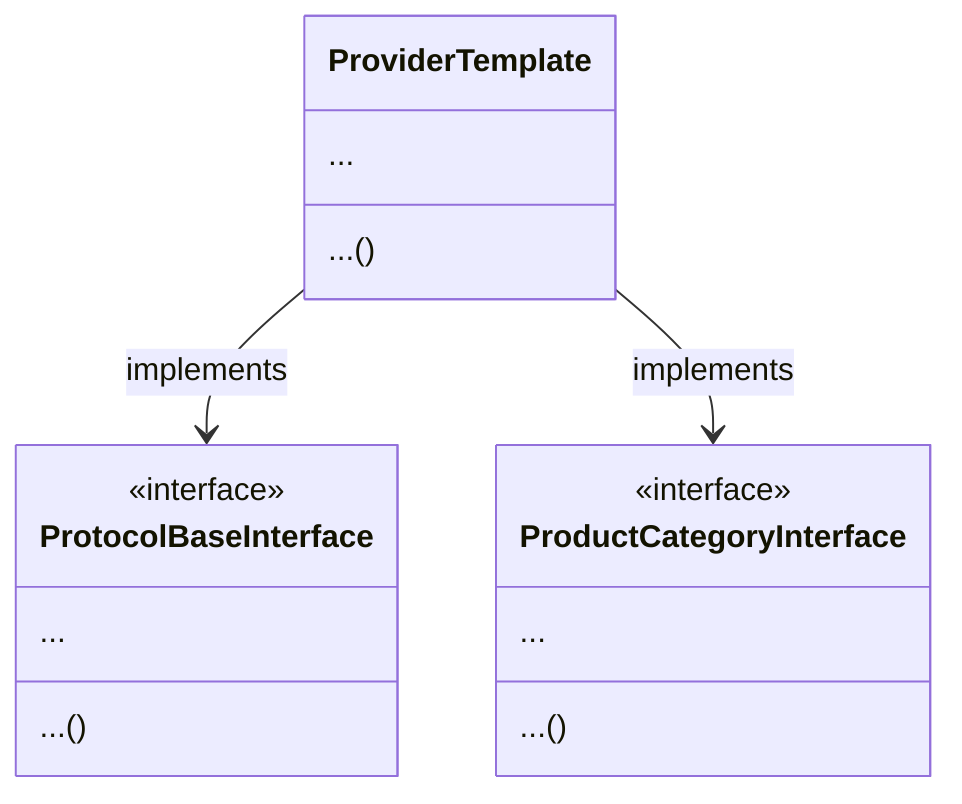

# {Product Category Name}

## Description
{Product Category Description}

## Basic Info
|                |                          |                
|----------------|-------------------------------|
|Software Stack / Service Type|`{Software Stack}`|
|Software Version (optional)|`{Software Version}`|
|||
|PC Smartcontract Address|`{SC Address}`|
|PC Registration Date | `{Date of Registration}`|
|||
|PC Owner Website|[link](https://{domain}/)|
|PC Owner Contact Info| e.g. [link](mailto:owner@domain.com)|
|PC Owner Wallet Address|`{Wallet Address}`|

## Resource Specification

Each Resource in this Product Category needs to defined with  the following properties:
|Name|Units|Description
|-|-|-|-|
|{Property Name 1}|`{Units}`|{Medium-form description}| 
|{Property Name 2}|`{Units}`|{Medium-form description}| 
|{Property Name 3}|`{Units}`|{Medium-form description}| 
...

## Configuration Parameters

This Product Category has the following configuration. These are enforced by the logic of the on-chain smartcontract.
|                |                          |                
|----------------|-------------------------------|
|Maximum Number of Validators|`{maxNumValidators}`|
|Maximum Number of Providers|`{maxNumProviders}`|
|Validator Registration Fee|`{valRegistrationFee}` FOREST tokens|
|Provider Registration Fee|`{provRegistrationFee}` FOREST tokens|
|Resource Registration Fee|`{resourceRegistrationFee}` FOREST tokens|
|Update Delay for Terms Change|`{termsUpdateDelay}` blocks|
|Validators Share of Emissions|`{rewardsSplit_validators}` %|
|Providers Share of Emissions|`{rewardsSplit_providers}` %|
|PC Owner Share of Emissions|`{rewardsSplit_pcOwner}` %|
|Performance Optimisation Weight |`{opWeight_performance}`%|
|Price Optimisation Weight|`{opWeight_price}`%|
|Price-to-Performance Optimisation Weight|`{opWeight_ptp}`%|
|Popularity Optimisation Weight|`{opWeight_popularity}`%|
|Hash of the Details File|`{CID}`|

You can always double-check the on-chain values e.g. [here](https://etherscan.io/address/{SC Address}#readContract)

## Tests and Quality Thresholds
The Validators are performing a number of tests on Resources to ensure quality across the board. Below is a list of checked Benchmarks:
|Name|Units| Theshold Value| Min / Max|                
|-|-|-|-|
|{Test Name 1}|`{Units}`|`{Value}`|{Min / Max}| 
|{Test Name 2}|`{Units}`|`{Value}`|{Min / Max}| 
|{Test Name 3}|`{Units}`|`{Value}`|{Min / Max}| 
...
More in-depth descriptions of the Tests:
|Name|Description|               
|-|-|
|{Test Name 1}|{Long form description}|
|{Test Name 2}|{Long form description}|
|{Test Name 3}|{Long form description}|
...

## Become a Provider [TODO]
#### Step-by-step instructions
In order to start providing services for this Product Category you need to:
1. Customize the Provider template from this repo by implementing required Interfaces (see instructions below).  Detailed instructions available also here:  [link](https://github.com/this_repo/provider/README.md)
2. Run your Node.
3. Install a Forest Protocols CLI by following these instructions: [link](https://github.com/forest-protocols/cli....)
4. Using the CLI register in the Protocol as a Provider:
a. `command 1`
b. `command 2`
5. Using the CLI register in our Product Category:
a. `command 1`
b. `command 2`

#### Customisation of the template
Each Provider needs to customise the Provider template from this Github Repo and implement the following interface to unify the way all Providers, Users and Validators communicate.

## Become a Validator [TODO]
#### Step-by-step instructions
In order to start providing validation services for this Product Category you need to:
1. Run your Validator Node based on the code from this repo. Detailed instructions here:  [link](https://github.com/this_repo/validator/README.md)
2. Install a Forest Protocols CLI by following these instructions: [link](https://github.com/forest-protocols/cli....)
3. Using the CLI register in the Protocol as a Validator:
a. `command 1`
b. `command 2`
4. Using the CLI register in our Product Category:
a. `command 1`
b. `command 2`